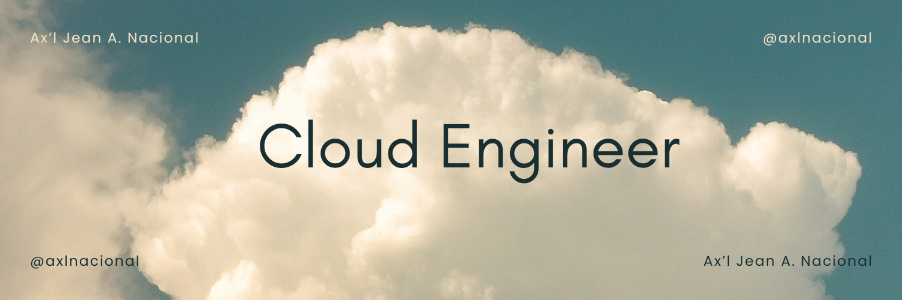

# Hi, I'm Mark

  

## About me

- Currently working as Associate Vice President at [JPMorgan Chase & Co.][https://www.jpmorganchase.com) (Philippines)
- Love for innovation and continues learning
- Passionate about problem-solving, software development, and automation
- Developing since 2015 with 8+ years of experience in Enterprise-wide software development
- Currently exploring software containerization and orchestration such as [Docker](https://docker.com) and [Kubernetes](https://kubernetes.io)
- Trying some simple web development projects with [React](https://react.dev)

## My specialties

`Java` | `Big Data` | `Hadoop` | `Linux` | `Git` | `Python` | `Shell` | `Kafka` | `Confluent` | `HBase` | `DevOps` | `Jenkins` | `CI/CD` | `Oracle MySQL` | `Hive` | `JavaScript` | `Docker` | `Springboot` | `Postman` | `REST` | `Testing` | `Troubleshooting` 

## How to reach me
- Contact me at [mark.arnaez29@gmail.com](mailto:mark.arnaez29@gmail.com)
- Checkout my resume here [📝](https://htmlpreview.github.io/?https://raw.githubusercontent.com/markarnaez/markarnaez/main/output/markarnaez-resume.html?sanitize=true), download it from here [⬇️](https://github.com/markarnaez/markarnaez/raw/main/output/markarnaez-resume.pdf) 

## Find me around the web
[LinkedIn](https://https://linkedin.com/in/mark-anthony-arnaez) | [Dev](https://dev.to/markarnaez) | [Instagram](https://instagram.com/watashiwazero) | [Facebook](https://fb.com/markanthony.arnaez) | [Medium]( https://medium.com/@markarnaez)

